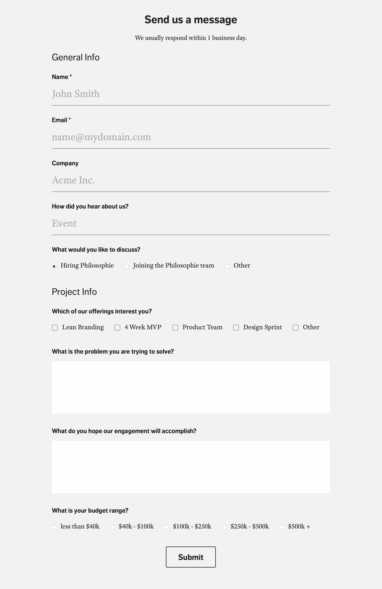

# FEWD Week #8: Forms

---


### Description 

This week, you'll be practicing your form skills: you have the option of adding a form to your final project, finishing the Relaxr form that will be started in class, or building a form for CitiPix. The form you build must include at least three different types of HTML form elements and some light CSS styling. We have given you an example of a form that renders well on the web and mobile devices, as well as an example, with starter code, of a registration form you could build for Relaxr.

<br>

---


### Real-World Applications

- Be able to apply the proper HTML and CSS styles to create a modern web form
- Revisit applications and projects to iterate on code you've written 


<br>

---


### Technical Requirements 

- Use at least three different types of HTML5 form elements: ```input```, ```textarea```, ```select```, ```radio``` ```button```, ```dropdown```, ```checkbox```
- Link to your sign-up page from different pages in your application 
- Style forms lightly using CSS
- Make sure a user's password is not visible when they are entering it

#### Bonus

- Use responsive media queries to allow for proper rendering on mobile devices 
- Use jQuery and display an error message if any of the input fields are left blank upon submission 
- To replicate application flow, add another page that says "Thanks for Relaxing with us!" after submission


<br>

---

### Resources

- [W3Schools: Form Elements](http://www.w3schools.com/html/html_form_elements.asp)
- [W3Schools: Input Types](http://www.w3schools.com/html/html_form_input_types.asp)
- [MDN: Styling HTML Forms](https://developer.mozilla.org/en-US/docs/Web/Guide/HTML/Forms/Styling_HTML_forms)
- [Webdesign.com: Form Validation with CSS3/HTML5](http://webdesign.tutsplus.com/tutorials/bring-your-forms-up-to-date-with-css3-and-html5-validation--webdesign-4738)
- [CSS-Tricks.com: Tips for Creating Great Web Forms](http://css-tricks.com/tips-for-creating-great-web-forms/)
- [jQuery API Docs: .val( ) function](http://api.jquery.com/val/)

Example forms





<br>

---

### Evaluation / Submission


Depending on the nature of their assignment, students should either use their code and repository from a previous project, or create a new folder and repository for their final project. When ready for evaluation, students should push their code to the appropriate repository. Instructional team should evaluate against the solution code and the student's use of technical elements. They will provide a numeric grade on a scale: does not meet expectations (0); meets expectations (1); exceeds expectations (2). **Note**: If bullet points have child bullets, the instructional team should grade the child bullets and not the parent bullet belonging to the child; also, if students decide to build a form as part of their final project, it should be graded as part of the final project. The maximum possible score on this assignment is 10/10. Bonus sections are completely optional.


### Final Project Milestone 3

By week 8, you should have submitted a draft of the JavaScript and jQuery you'll need for your final project.  For this week, focus iterating on your project to turn in an updated draft. 

